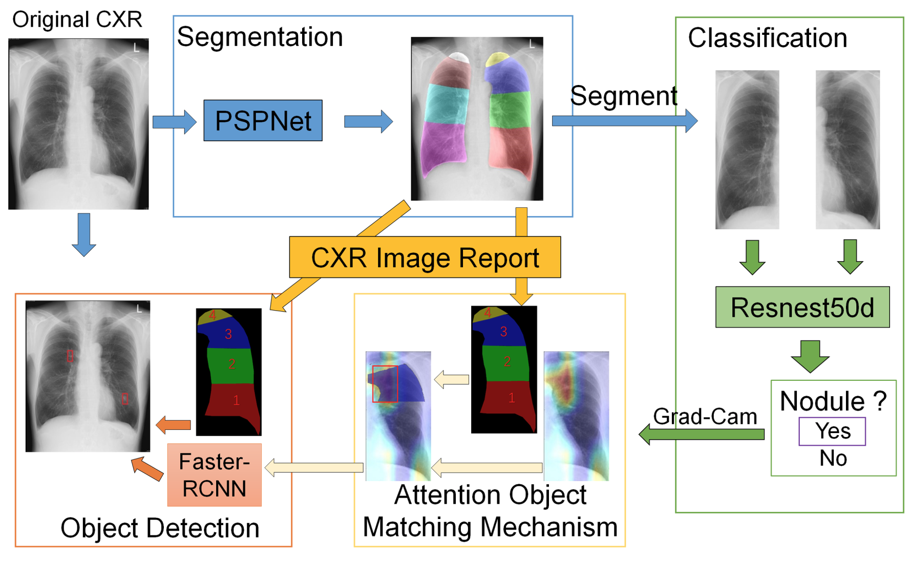

# Automatic creation of annotations for chest radiographs based on the positional information extracted from radiographic image reports
[PDF]()

## Model Structure


## Abstract
Machine learning for computer aided image diagnosis requires annotation of images, but
manual annotation is time-consuming for medical doctor. In this study, we tried to create a
machine-learning method that creates bounding boxes with disease lesions on chest X-ray
(CXR) images using the positional information extracted from CXR reports. We set the nodule
as the target lesion. First, we use PSP-Net to segment the lung field according to the CXR
reports. Next, a classification model ResNeSt-50 was used to discriminate the nodule in
segmented lung field. We also created an attention map using the Grad-Cam algorithm. If the
area of attention matched the area annotated by the CXR report, the coordinate of the bounding
box was considered as a possible nodule area. Finally, we used the attention information
obtained from the nodule classification model and let the object detection model trained by all
of the generated bounding boxes. Through object detection model, the precision of the bounding
boxes to detect nodule is improved.

## Usage

##### Data Set
The datasets of CXR images and CXR reports are not publicly available due to restrictions based on privacy regulations and informed consent of the participants, but are available from the corresponding author on reasonable request.

##### DataExtraction
This file is used to extract dicom images from database of Osaka University Hospital.

##### SemanticSegmentation
We provide some semantic model for lung field extraction. PSPNet is applied in the paper.
```
In train.py classification_generate() is used for segment the lung field.
```

##### Classification

##### Detection
Based on Faster-RCNN with pyramid feature module.

## Acknowledgements
This work was supported by JSPS KAKENHI Grant Number JP20K07196 and by Council
for Science, Technology and Innovation (CSTI), cross-ministerial Strategic Innovation
Promotion Program (SIP), "Innovative AI Hospital System" (Funding Agency: National
Institute of Biomedical Innovation, Health and Nutrition (NIBIOHN)).

## Publication
If you want to use this work, please consider citing the following paper.
```
@article{wang2021automatic,
  title={Automatic creation of annotations for chest radiographs based on the positional information extracted from radiographic image reports},
  author={Wang, Bowen and Takeda, Toshihiro and Sugimoto, Kento and Zhang, Jiahao and Wada, Shoya and Konishi, Shozo and Manabe, Shirou and Okada, Katsuki and Matsumura, Yasushi},
  journal={Computer Methods and Programs in Biomedicine},
  pages={106331},
  year={2021},
  publisher={Elsevier}
}
```
